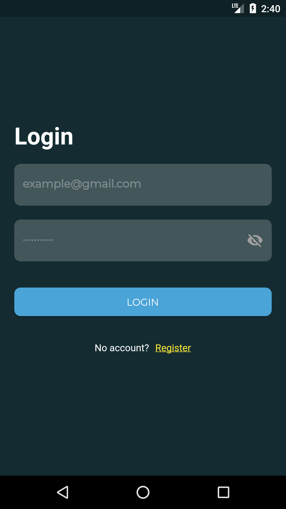
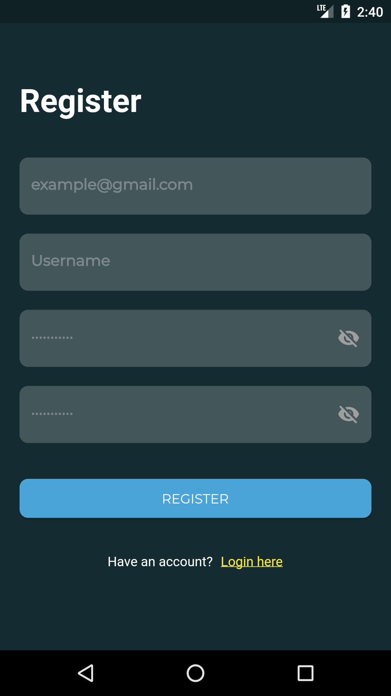
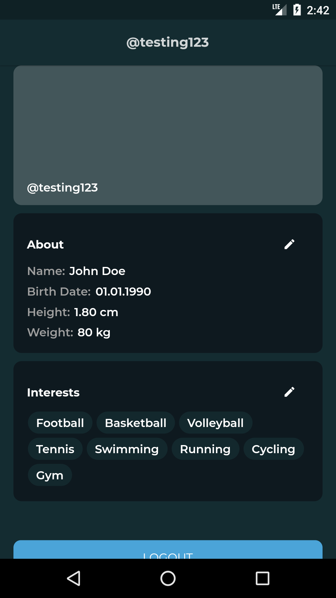

## Flutter Project README.md

### Title: MyProfileApp

### Description:

This application implements bloc and cache to store JWT.

### Getting Started

To get started with this Flutter project, follow these steps:

1. Clone the repository to your local machine.
2. Install Flutter SDK.
3. Copy the `.env.example` file to `.env`.
4. Open the `.env` file and update the necessary values.
5. Run `flutter pub get` to install the project dependencies.
6. Run `flutter run` to start the application.

### Example Images

<!-- Inserted code starts here -->

<!-- Insert images here -->

<!-- Inserted code ends here -->

If you want to see examples of the application's UI, you can find them in the `images` folder.

### Login, Register, and Edit Profile

This Flutter project includes the following additional features:

- Login functionality
- Register functionality
- Edit profile functionality

### Backend Implementation

To implement the backend functionality, you can use the following GitHub repository as a reference: [Nest MongoDB API](https://github.com/exceldeo/nest-mongodb-api).
